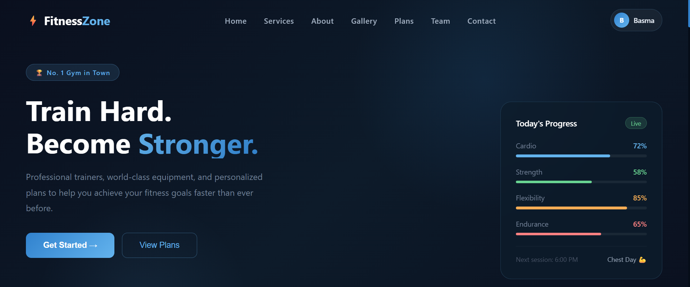
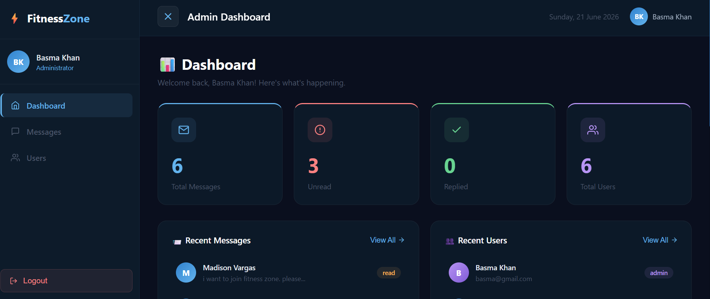
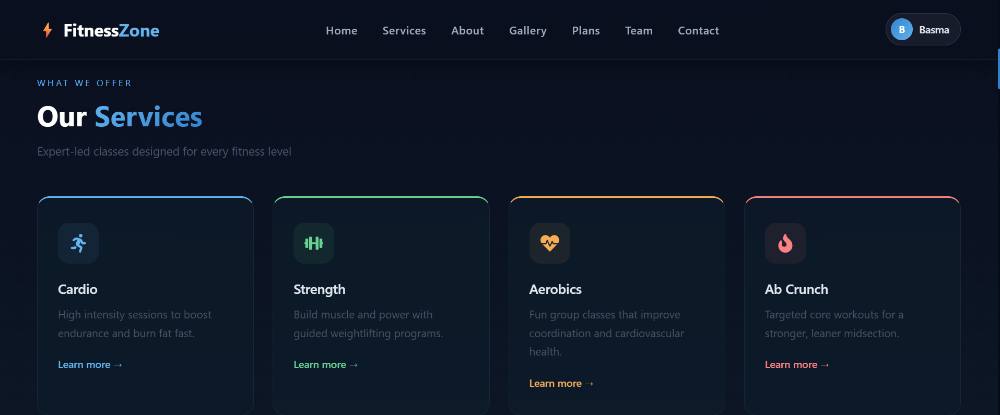
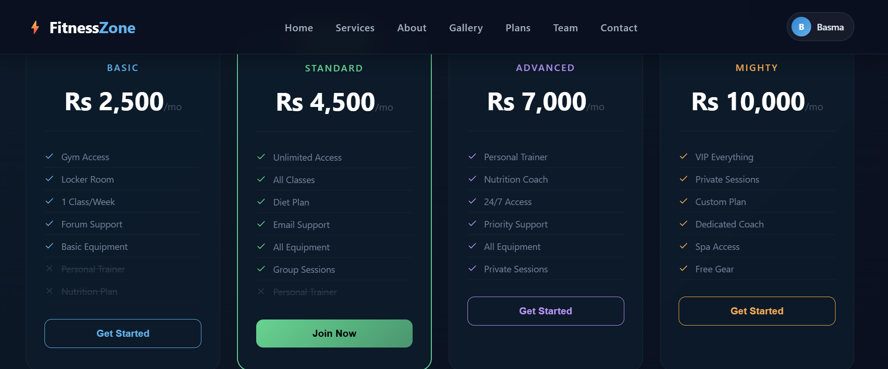
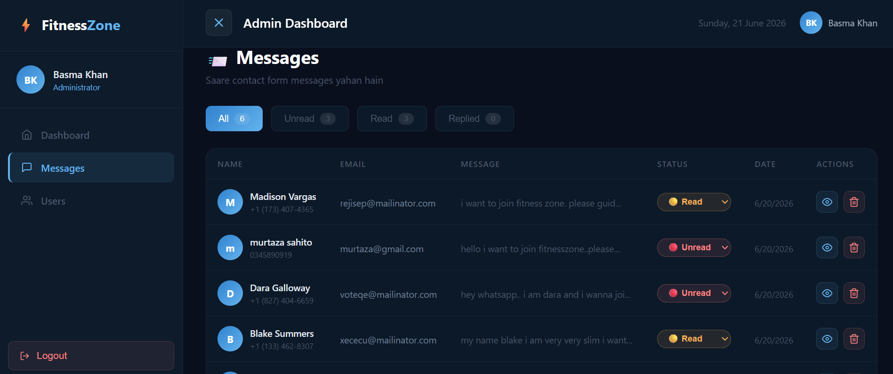

# ⚡ FitnessZone — MERN Stack Gym Management Platform

A full-stack fitness center website built with the **MERN stack** (MongoDB, Express, React, Node.js), featuring a public-facing site with class enrollment, an admin dashboard for managing members and inquiries, and JWT-based role authentication.

**Live Demo:** [fitness-zone-frontend.vercel.app](https://fitness-zone-frontend.vercel.app)
**Backend API:** [fitness-zone-backend.vercel.app](https://fitness-zone-backend.vercel.app)

---

## 📸 Screenshots

| Home Page | Admin Dashboard |
|:---:|:---:|
|  |  |

| Services Modal | Pricing Plans |
|:---:|:---:|
|  |  |

| Admin Messages |
|:---:|
|  |

---

## 📋 Overview

FitnessZone was originally a static HTML/CSS/JS gym template. This project is a complete **migration and rebuild** into a production-style MERN application — replacing static markup with a component-based React architecture, adding a real backend with authentication, and building an admin dashboard for day-to-day gym operations.

---

## ✨ Features

### Public Website
- Animated hero, services, about, and pricing plan sections (Framer Motion)
- Interactive **service detail modals** with schedules, trainer info, and benefits
- **Photo gallery** with category filtering (Gym / Cardio / Aerobics)
- **Team page** with trainer bios and achievements
- **Contact form** that saves directly to MongoDB
- **Auth modal** (Login / Sign Up) triggered on enrollment actions — no forced login wall

### Authentication & Authorization
- JWT-based authentication with bcrypt password hashing
- Role-based access control (`user` / `admin`)
- Protected routes on the frontend — unauthorized users are redirected
- Admins can promote/demote other users directly from the dashboard

### Admin Dashboard
- Live stats (total messages, unread, replied, total users) pulled from the database
- **Messages management** — view full message, update status (unread/read/replied), delete
- **User management** — promote to admin, remove admin access, delete accounts
- Recent activity feed and quick-action shortcuts
- Fully responsive, animated sidebar layout

---

## 🛠️ Tech Stack

**Frontend**
- React (Vite)
- React Router DOM
- Framer Motion (animations)
- Axios
- Recharts (data visualization)
- React Icons

**Backend**
- Node.js + Express
- MongoDB Atlas + Mongoose
- JWT (jsonwebtoken)
- bcryptjs
- CORS

**Deployment**
- Frontend & Backend: Vercel
- Database: MongoDB Atlas

---

## 🗂️ Project Structure

```
fitness-zone/
├── frontend/
│   ├── src/
│   │   ├── components/      # Navbar, Hero, Services, Plans, Team, Contact, AuthModal, AdminLayout...
│   │   ├── pages/            # Home, AdminDashboard, AdminMessages, AdminUsers
│   │   └── App.jsx
│   └── package.json
│
└── backend/
    ├── config/                # MongoDB connection
    ├── controllers/           # authController, contactController
    ├── middleware/             # JWT protect & adminOnly middleware
    ├── models/                  # User, Contact (Mongoose schemas)
    ├── routes/                  # authRoutes, contactRoutes
    ├── Server.js
    └── package.json
```

---

## 🔌 API Endpoints

| Method | Endpoint | Access | Description |
|--------|----------|--------|--------------|
| POST | `/api/auth/register` | Public | Register a new user |
| POST | `/api/auth/login` | Public | Login & receive JWT |
| GET | `/api/auth/users` | Admin | List all users |
| PUT | `/api/auth/make-admin/:id` | Admin | Promote a user to admin |
| PUT | `/api/auth/remove-admin/:id` | Admin | Demote an admin to user |
| DELETE | `/api/auth/users/:id` | Admin | Delete a user |
| POST | `/api/contact` | Public | Submit a contact form message |
| GET | `/api/contact` | Admin | View all contact messages |
| PUT | `/api/contact/:id` | Admin | Update a message's status |
| DELETE | `/api/contact/:id` | Admin | Delete a message |

All admin routes are protected with a custom JWT middleware (`protect`) and a role check (`adminOnly`).

---

## ⚙️ Getting Started

### Prerequisites
- Node.js (v18+)
- MongoDB Atlas account

### 1. Clone the repositories
```bash
git clone https://github.com/Basma-Hassan95/fitness-zone-frontend.git
git clone https://github.com/Basma-Hassan95/fitness-zone-backend.git
```

### 2. Backend setup
```bash
cd fitness-zone-backend
npm install
```

Create a `.env` file:
```
PORT=5000
MONGO_URI=your_mongodb_connection_string
JWT_SECRET=your_jwt_secret
```

```bash
npm run dev
```

### 3. Frontend setup
```bash
cd fitness-zone-frontend
npm install
npm run dev
```

The app will run on `http://localhost:5173`, connecting to the backend on `http://localhost:5000`.

---

## 🔐 Security Notes
- Passwords are hashed with bcrypt before storage — never stored in plain text.
- JWTs expire after 7 days.
- Admin routes are protected at the middleware level, not just on the frontend.
- The first admin account is set manually in the database; subsequent admins are promoted through the dashboard by an existing admin — preventing self-service privilege escalation.

---

## 🚀 Roadmap
- [ ] Profile picture upload (Multer/Cloudinary)
- [ ] Email notifications on new contact messages
- [ ] Member payment/subscription tracking
- [ ] Pagination for messages and users tables

---

## 👩‍💻 Author

**Basma Hassan**
[GitHub](https://github.com/Basma-Hassan95)

---

## 📄 License

This project is open source and available for learning purposes.